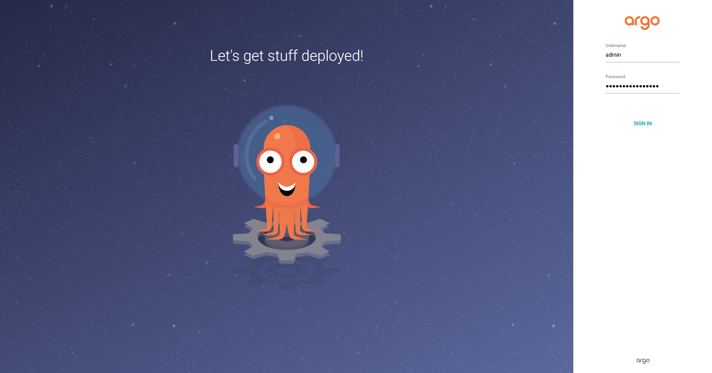
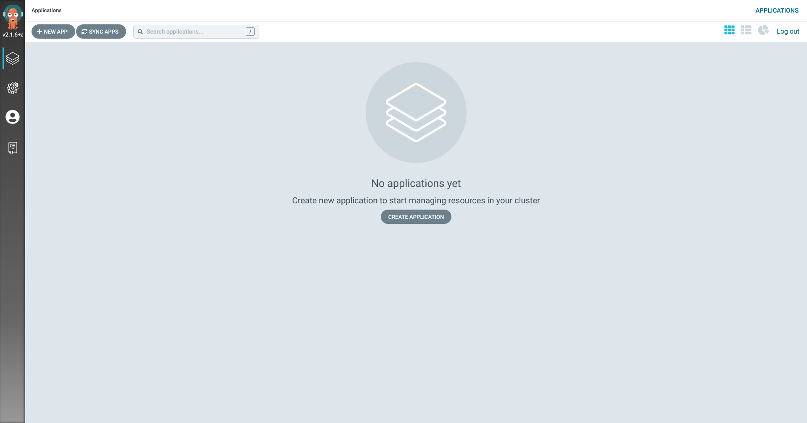

KubernetesにArgo CDをインストールするため、Helmリポジトリを設定します。
まず、ArgoのHelmリポジトリを追加します：

`helm repo add argo https://argoproj.github.io/argo-helm`{{execute}}

それから、このローカル環境内のリポジトリの情報を更新します：

`helm repo update`{{execute}}

次のコマンドで、Argo CDをインストールします：

`helm install argocd argo/argo-cd`{{execute}}

インストールには時間がかかります。
Podのステータスが `Running` となるまで、次のコマンドを実行します：

`kubectl get po -l app.kubernetes.io/name=argocd-server`{{execute}}

Argo CDは `admin` という名前の初期の管理者アカウントを作成します。
次のコマンドを実行して、パスワードを取得します：

`kubectl -n default get secret argocd-initial-admin-secret -o jsonpath="{.data.password}" | base64 -d; echo`{{execute}}

Argo CDのWeb UIにアクセスするため、次のコマンドを実行して環境のポートを転送します：

`kubectl port-forward svc/argocd-server 443:443 --address 0.0.0.0 &> /dev/null &`{{execute}}

`ArgoCDダッシュボード` タブを開いて、`admin` としてログインします。

ダッシュボードにアプリケーションがないことが分かります。

次は、自身のGitリポジトリを作成し、自身のデプロイ設定をプッシュします。
